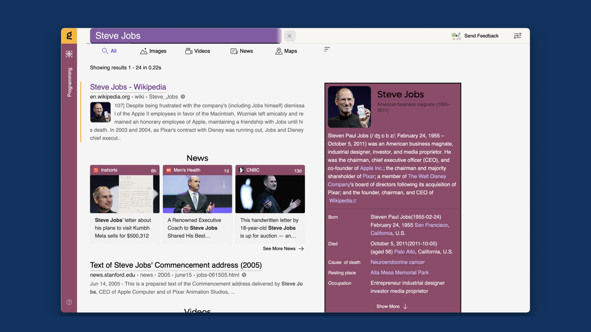
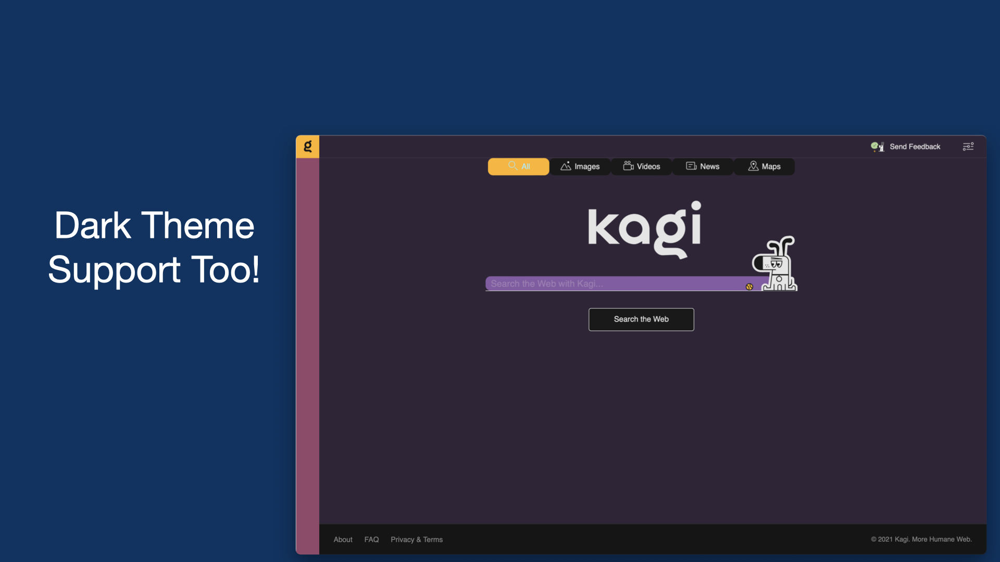
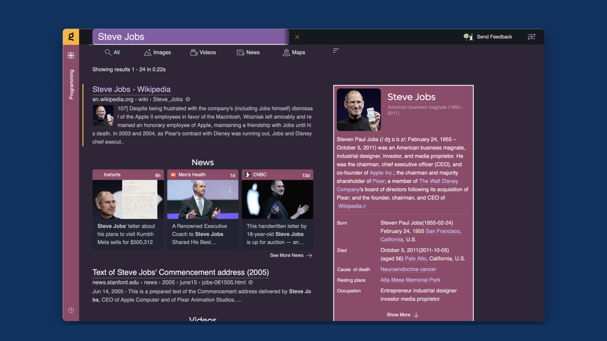

# Kagi Theme

This is a custom theme for Kagi Search

## Screenshots

## 

## Usage

In the Kagi Search engine navigate to the appearence settings, then at the bottom there should be a "custom css" option, choose that then copy the full contents of theme.css into the field and save. 
If you want the ball in the background, is is *slightly* more complex, that is you must copy the contents of ball.svg to the top of the custom css field and then the contents og theme.css below it, 

**for reference theme.css is in the dist folder, as of now theme.scss will not work in the custom css field**
## Ideas for later

- [ ] Add support for userstyle browser extensions

- [ ] Tweak the colours a bit more

- [ ] Customize the UI a lot more,
  - I am trying to go for a Modern Design that is friendly and fimiliar... 
  - Maybe I could change up the colors? 
  - Maybe I could also customize the toggles?
  - What should the at a glance wikipedia results look like? 
    - Should they be in a distinct container? 
    - News results, should they be brighter? 

## Contributing

Contributing is welcome at this time, but I may take some time to review any pull request, also keep in mind that this theme is early alpha made for a Search Engine that is in Beta, so things may break as changes are made to the Kagi Search Engine... Also note that I did write this fast so expect my code at this stage to be very messy, I will think about refactoring it later, but not now...
